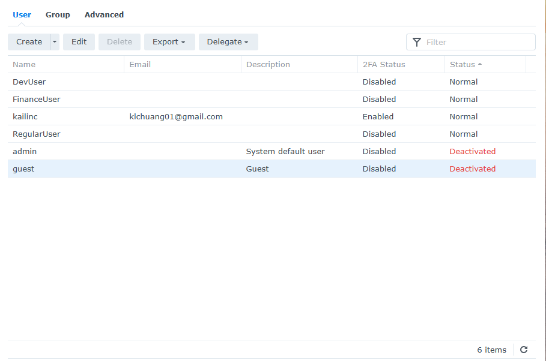
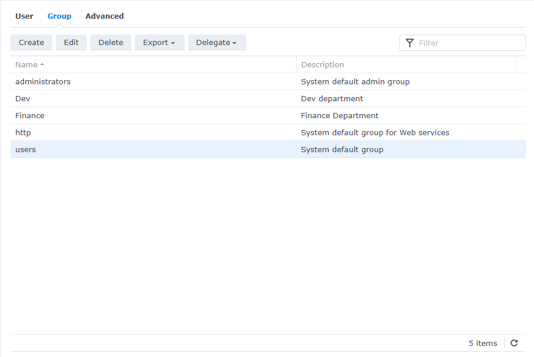
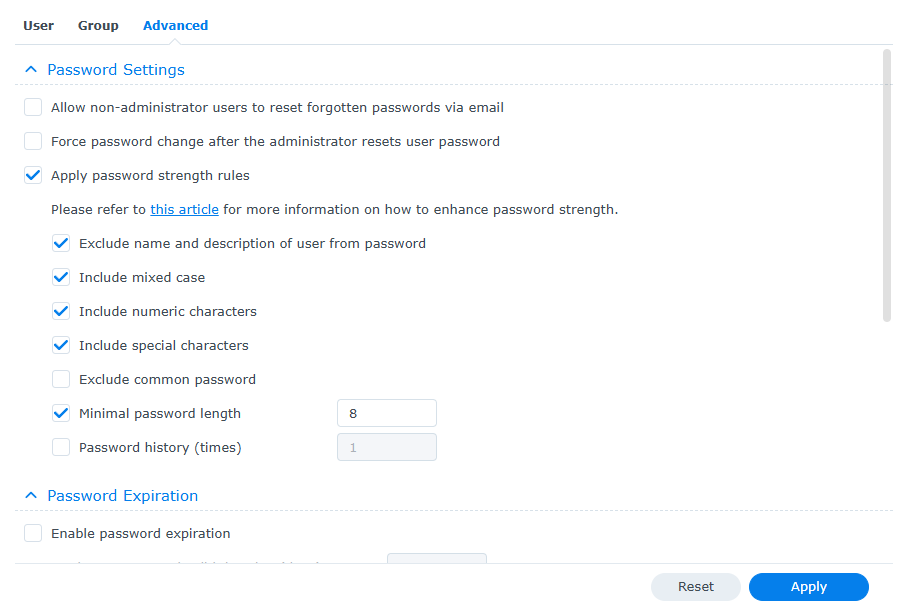
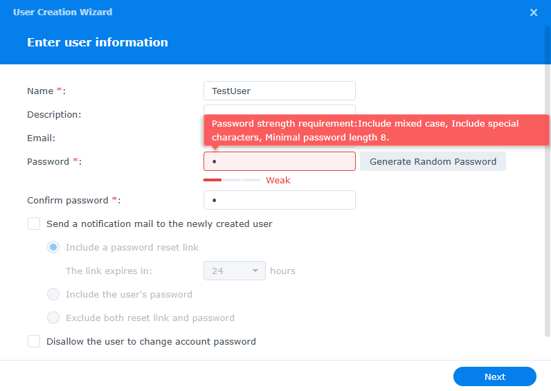
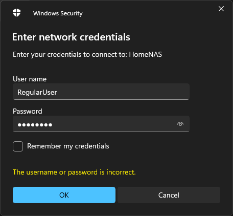
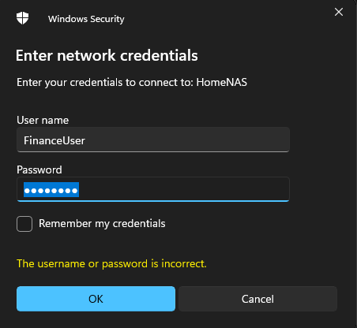
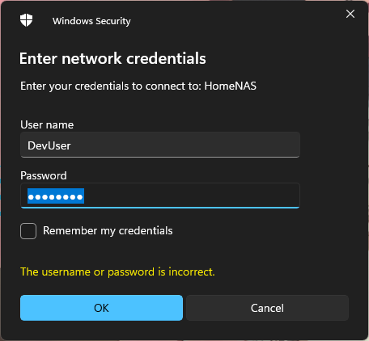

# 🛠️ Synology NAS – User Access Simulation Lab

This project simulates a small business network setup where users are divided into groups based on job roles (Dev, Finance, General Staff). It demonstrates the creation of users, application of strict password policies, and the enforcement of access control using Synology NAS.

---

## 📌 Overview

This simulation replicates how a system administrator would:
- Manage users across different departments.
- Apply the **Principle of Least Privilege** to folder access.
- Protect admin-only folders (e.g., `MyStorage`, `Workspace`).
- Enforce **secure password policies** to strengthen network access control.

---

## 🎯 Key Objectives

- Practice setting up and organizing **users and groups** using Synology DSM.
- Configure **password rules** (complexity, length, exclusions).
- Test file access with restricted permissions per group.
- Strengthen understanding of **real-world system admin tasks**.

---

## 👤 User and Group Setup

**Users:**
- `DevUser`
- `FinanceUser`
- `RegularUser`

**Groups:**
- `Dev`
- `Finance`
- `users` (Synology's default group)

**Admin Account:**
- `kailinc` (admin)

📷 Screenshots:
- 
- 

---

## 🔐 Password Policy

**Enforced Rules:**
- Minimum length: 8 characters
- Must include mixed case, numbers, and symbols
- Cannot include the user's name or description

📷 Screenshots:
- 
- 

---

## 📁 Folder Access by User Role

| User          | Group     | Accessible Folders             | Notes                                |
|---------------|-----------|--------------------------------|----------------------------------------|
| `RegularUser` | `users`   | `PublicFolder` only            | No access to Dev or Finance folders   |
| `FinanceUser` | `Finance` | `PublicFolder`, `FinanceFolder`| Access limited to finance-related data|
| `DevUser`     | `Dev`     | `PublicFolder`, `DevFolder`    | No access to Finance folder           |

📷 Screenshots:
- 
- 
- 

🎥 Video Walkthroughs:
- [`RegularUser_Access.mp4`](./video/RegularUser_Access.mp4)

https://github.com/user-attachments/assets/1475a83f-af78-4604-8d3c-5d21cbfd2a5a

---

## 🧠 Summary & What I Learned

This simulation helped me:
- Get hands-on experience managing **user roles and permissions**.
- Understand **password hardening** in a production-like environment.
- Reinforce core concepts of **least privilege** and **role-based access control**.
- Better prepare for real-world **System Administrator** responsibilities.
