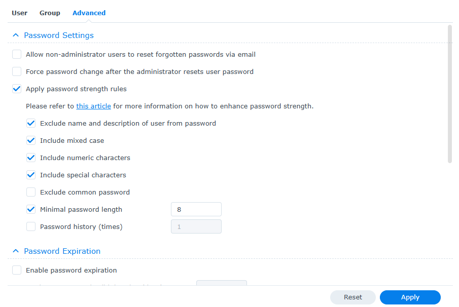
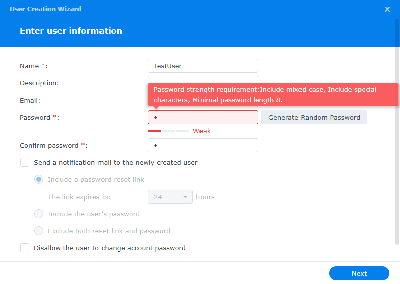

📘 [English](README.md) | 📙 [中文](README_zh.md)

# 💽 Synology NAS –  使用者模擬實驗

本專案模擬一個小型企業NAS架構。 使用者根據職務角色（例如：開發部、財務部與一般員工）劃分使用者群組。這個模擬的目的是展示如何進行使用者與群組管理，實作安全的密碼政策，以及在設定 Synology NAS 的共享資料夾時，遵守最小權限原則。同時也是讓我實際操作 NAS 設定與管理的練習過程。

---

## 🔍 概觀

以下是此模擬情境的設定:
- 管理不同部門的使用者。
- 對資料夾存取權限設定最小權限原則。
- 保護只有管理員可存取的資料夾（例如：`MyStorage`, `Workspace`）。
- 實施安全密碼規則來強化使用者登入控制。

---

## 🎯 主要目標

- 練習使用 Synology DSM 建立與管理**使用者與群組**。
- 設定**密碼規則**（複雜度，長度，排除項）。
- 測試依照群組限制的檔案存取權限。
- 累積實務操作經驗，熟悉使用者管理與登入控制的流程。

---

## 👤 使用者與群組設定

在本模擬環境中，我建立了三位使用者，並將他們分成不同部門的群組。此外，我也使用一個主要的管理帳號來操作本模擬環境與我個人的 NAS 使用。

**使用者:**
- `DevUser`
- `FinanceUser`
- `RegularUser`

**群組:**
- `Dev`
- `Finance`
- `users` (Synology's default group)

**管理帳號:**
- `kailinc` (admin)

📷 截圖:

---

## 🔐 密碼規則

**強制規則:**
- 最短長度：8個字
- 必須包含大小寫，數字與符號
- 不得包含使用者名稱或描述欄中的文字

📷 截圖:

---

## 📁 根據單位的資料夾權限

| 使用者         | 群組      | 可使用的資料夾                  | 備註                                    |
|---------------|-----------|--------------------------------|----------------------------------------|
| `RegularUser` | `users`   | 僅限`PublicFolder`             | 無法存取 Dev 或 Finance 資料夾          |
| `FinanceUser` | `Finance` | `PublicFolder`, `FinanceFolder`| 僅限存取財務相關資料                    |
| `DevUser`     | `Dev`     | `PublicFolder`, `DevFolder`    | 僅限存取開發相關資料                    |

🎥 操作影片:
- 一般員工資料夾存取

https://github.com/user-attachments/assets/efd73783-7f67-4bc9-8ed7-a2b992ae486f

- 財務部使用者資料夾存取

https://github.com/user-attachments/assets/9e257319-ac77-4cc8-bf45-9eabc6ab3def

- 開發部使用者資料夾存取

https://github.com/user-attachments/assets/7cb5c6f3-b050-496d-9e77-29a85c857909

---

## 🧠 結論

這次模擬實驗幫助我:
- 實際操作如何管理**使用者角色與權限**。
- 了解在環境中如何**強化密碼安全性**的方式。
- 鞏固**最小權限原則**與**角色型存取控制**等核心概念。
- 為將來的**系統管理員**工作做好更充足的準備。
